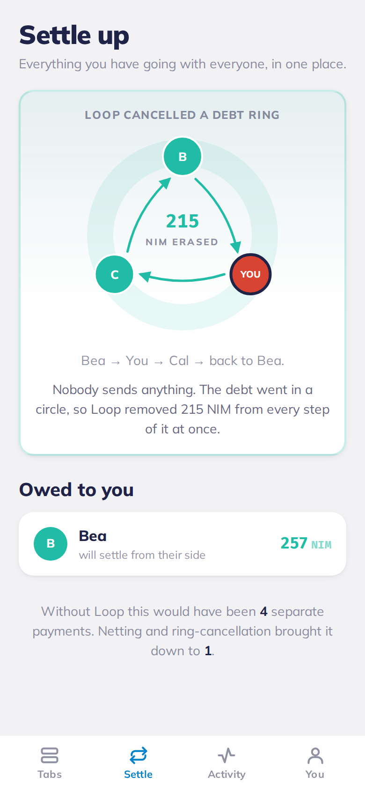
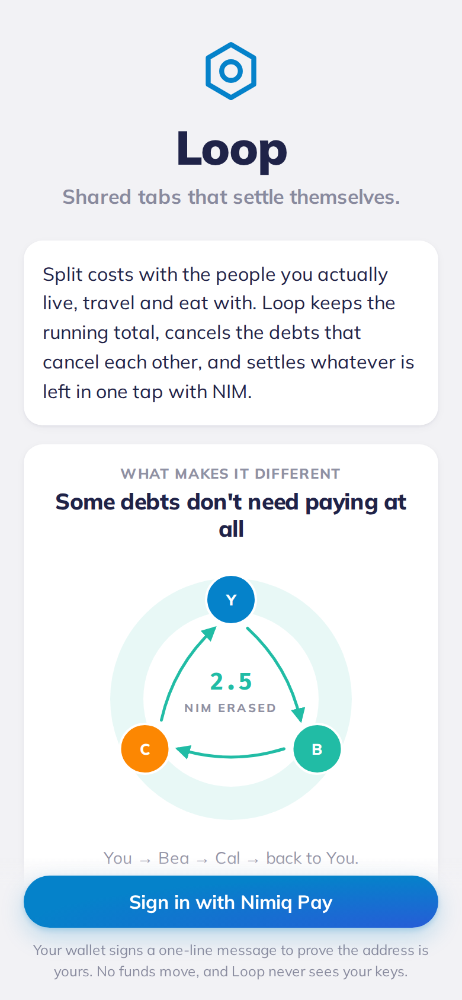
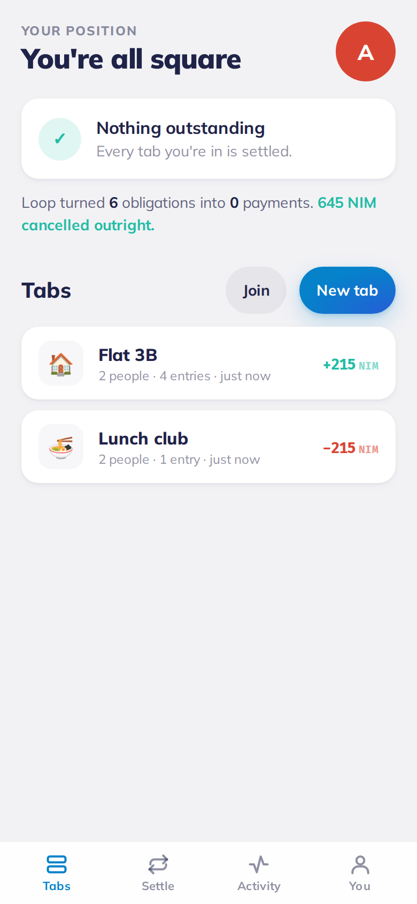
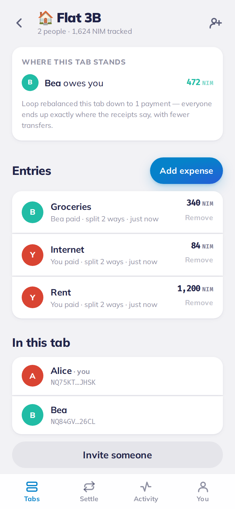
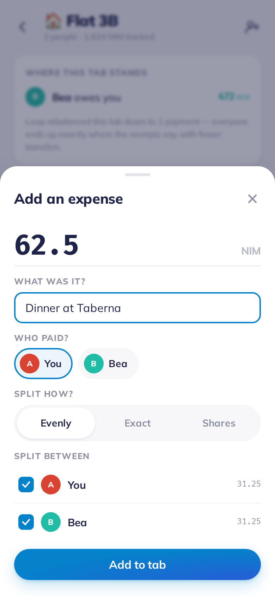
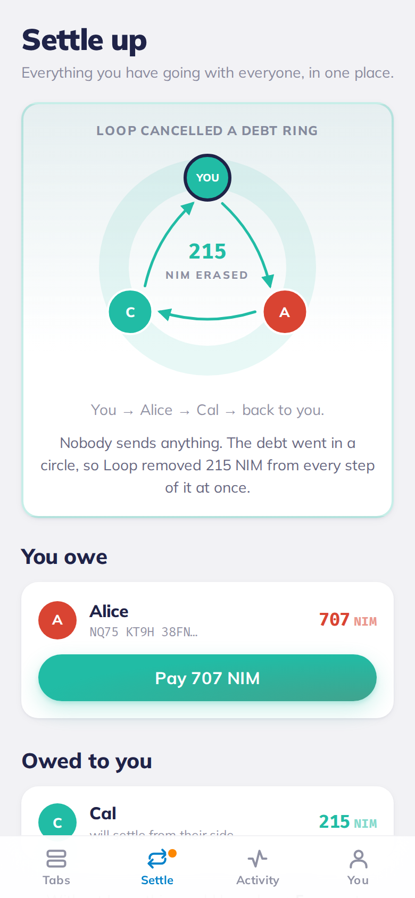
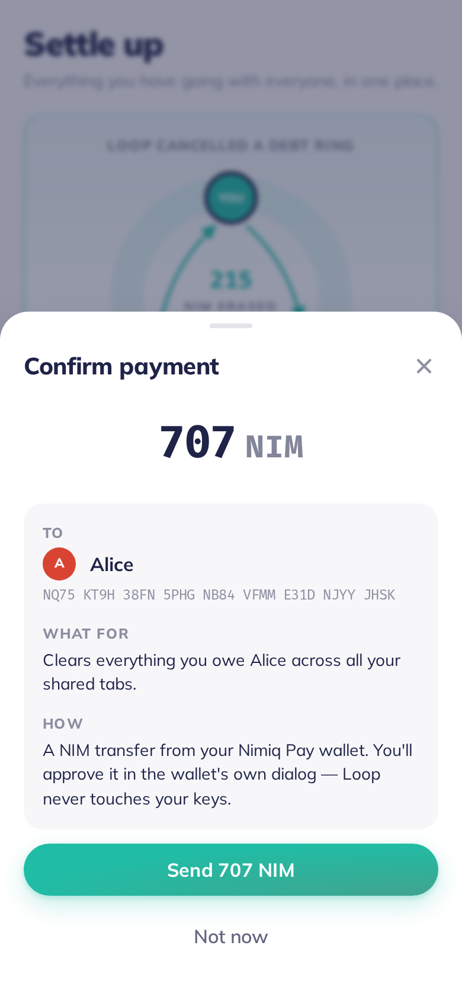
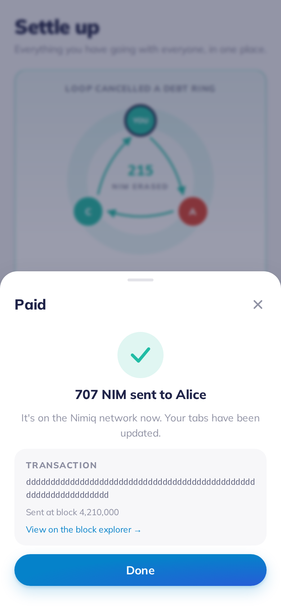
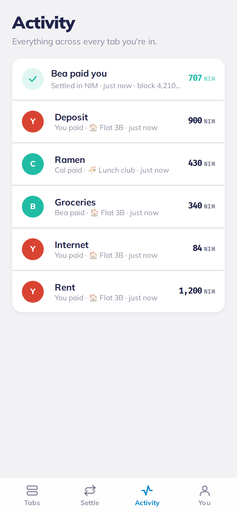
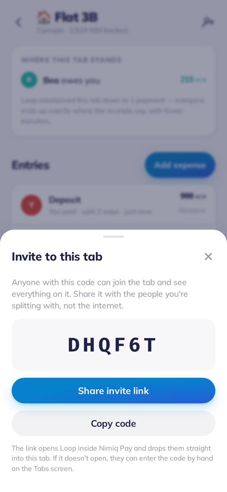

# Loop

**Live:** https://loop-miniapp.mjusto.workers.dev · **Open in Nimiq Pay:** https://nimpay.app/miniapps/open/loop-miniapp.mjusto.workers.dev

**Shared tabs that settle themselves.** A mini app for [Nimiq Pay](https://nimiq.com/nimiq-pay/).

Split costs with the people you actually live, travel and eat with. Loop keeps the running total,
cancels the debts that cancel each other, and settles whatever is left in one tap with NIM.

Built for the [Nimiq Mini Apps Competition](https://miniappscompetition.com), Cycle II.

---

## The thing it does that nothing else does

Every expense splitter can tell you that you owe Bea 250 NIM. None of them notice that Bea owes Cal
250, and Cal owes you 250 — because that debt lives in three *different groups*, and no one group
can see the whole picture.

That ring is imaginary money. Three payments, three fees, three awkward reminders, and at the end
everyone is exactly where they started.

Loop finds the ring and deletes it.

<p align="center">
  
</p>

It works across tabs you are not in. You are in the flat tab with Bea; Bea is in a ski tab with Cal
that you have never seen; Cal is in a lunch tab with you. Nobody standing in any one of those tabs
could ever spot the loop. Loop walks the whole connected component of the money graph and finds it.

**The rule it will not break:** rebalancing only ever happens *inside* a tab, where everyone already
agreed to share a ledger. Across tabs, Loop only cancels closed rings — which strictly *reduces*
debts that already existed. Loop will never tell you to pay someone you have never shared a bill
with.

## How it works

1. **Start a tab** — a trip, a flat, a dinner. Share the six-character code; people join.
2. **Add what you paid** — split evenly, by exact amounts, or by shares.
3. **Settle in one tap** — real NIM from your Nimiq Pay wallet, with the block height recorded.

Three layers of maths run on every read:

| Layer | What it does | Scope |
| --- | --- | --- |
| Pair netting | Twelve dinners between five people collapse to one number per pair | Everywhere |
| In-tab rebalancing | "B pays A 300" instead of "B pays A 200, B pays C 100, C pays A 100" | Inside one tab |
| Ring cancellation | A closed loop of debt is deleted from every step at once | Across all tabs |

Every net position is identical before and after. There are just far fewer payments.

## Nimiq Pay integration

Payments are not bolted on — settling *is* the product.

- **Sign-in is a wallet signature.** The server issues a single-use challenge, Nimiq Pay signs it
  with `nimiq.sign()`, and the server derives the address from the public key. Your identity here is
  your Nimiq address; there is no password to lose and no email to leak.
- **Settlement is a real NIM transfer** via `sendBasicTransactionWithData`, carrying a memo so the
  recipient can see what it was for in their own wallet history.
- **Consensus is checked** with `isConsensusEstablished()` before a payment is offered, so the app
  does not send you into a dialog your wallet cannot honour.
- **Block height is recorded** via `getBlockNumber()` and shown on the receipt and in the tab.
- **Language** follows `window.nimiqPay.language`.

Every state is handled explicitly:

| What happens | What Loop does |
| --- | --- |
| You approve | Records the hash and block, clears the debt across the exact tabs it came from |
| You cancel in the wallet | "Payment cancelled — nothing was sent." The debt is untouched |
| The wallet errors | The pending record is marked failed; balances never moved |
| You are not in Nimiq Pay | Explains why, keeps everything else readable |

A payment never touches a balance until the wallet confirms it. A pending settlement is invisible to
the maths.

## Screenshots

| | | |
| --- | --- | --- |
|  |  |  |
| Welcome | Your tabs | Inside a tab |
|  |  |  |
| Adding an expense | Settling up | Confirming a payment |
|  |  |  |
| Receipt | Activity | Inviting people |

## Architecture

One Cloudflare Worker serves both the built Vue app and the API, so there is a single origin and no
CORS to get wrong.

```
shared/     netting.ts          the engine: pair netting, ring cancellation, in-tab rebalancing
            nimiq-address.ts    base32 + BLAKE2b address derivation, pure JS
            nimiq-signature.ts  Ed25519 verification of a Nimiq-signed message
worker/     index.ts            Hono routes
            auth.ts             challenge / verify / session
            ledger.ts           rows in, live balances out
src/        lib/nimiq.ts        the only file that touches the wallet
            views/              welcome, tabs, tab, settle, activity, profile
test/       netting.test.ts     property tests over thousands of random debt graphs
            nimiq-crypto.test.ts  checked against the real @nimiq/core WASM library
            e2e.mjs             57 checks against a running Worker with real signatures
            ui.mjs              35 checks driving the real app in a real browser
```

### Two decisions worth explaining

**Money is always an integer count of luna.** No floats touch a balance. Every splitter — even, exact
and by-shares — is proven to sum to the exact total, including the leftover luna, because "the
numbers don't add up" is the one bug a money app is not allowed to have.

**Netting is never stored.** Only expenses and real payments are persisted; the netting and ring
cancellation are recomputed on every read. A cancelled ring is a statement about the current state of
the graph, not a transaction — if someone adds a dinner an hour later, the ring should quietly
re-form and Loop should say so. Storing the result would let the stored answer drift from the real
one, and the first time that happens somebody loses money.

## Security

- Loop has no access to private keys. Every signature and every transfer goes through Nimiq Pay's own
  native approval dialog.
- The address is derived from the public key server-side, never taken from the request body. A caller
  cannot claim an address they do not hold the key for.
- Login challenges are single-use and expire in five minutes.
- Sessions are stored as a SHA-256 of the bearer token, so a database dump hands nobody a live
  session.
- Tab membership is checked on every read and every write.
- A ring can pass through someone you have never shared a tab with. Their address is replaced with a
  placeholder, so the ring is legible without exposing a stranger's identity or their balances.

## Testing

```bash
npm test                 # 40 unit tests — netting properties, address and signature crypto
npm run dev:worker &     # then, in another shell:
node test/e2e.mjs        # 57 API checks against a live Worker, with real Nimiq signatures
node test/ui.mjs         # 35 browser checks, three mock wallets, screenshots
```

The crypto tests verify the pure-JS address derivation and signature verification against the real
`@nimiq/core` WASM library over hundreds of random key pairs. The netting tests are property-based:
across thousands of randomly generated debt graphs they assert that every person's net position is
unchanged, that no debt is ever increased, and that no payment is ever invented between two people
who had none.

`@nimiq/core` and Playwright are test-only dependencies. Neither ships in the Worker or the browser
bundle.

## Running it yourself

**Prerequisites:** Node 22+, a Cloudflare account, Nimiq Pay on a phone.

```bash
npm install

# Create the database and note the id it prints.
npx wrangler d1 create loop-db
# Paste that id into wrangler.toml under [[d1_databases]].

npm run db:local          # apply the schema locally
npm run db:remote         # and to the real database

npm run dev               # Vite with hot reload on :5173
npm run dev:worker        # the Worker + D1 on :8787 (Vite proxies /api to it)
```

Open Nimiq Pay → Mini Apps → enter the Network URL that Vite prints (the `192.168.x.x` one, not
`localhost` — inside the WebView, `localhost` is the phone).

For payment testing, switch Nimiq Pay to testnet: long-press the settings button for ten seconds to
reveal the dev menu. "Get free NIM" credits 110,000 testnet NIM.

```bash
npm run deploy            # build + wrangler deploy
```

## Licence

MIT. Mulish and Fira Mono are SIL Open Font License 1.1.
